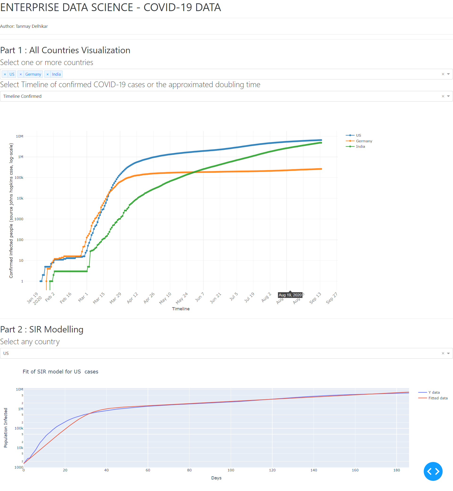

# ENTERPRISE DATA SCIENCE 2020

## Python Dash application to visualize Covid-19 data.


#### STEP 1 : Install all python dependencies
```sh
$pip install -r requirements.txt
```


#### STEP 2 : Change directory in the terminal to ***app*** folder
```sh
$cd app
```


#### STEP 3 : Run the application
```sh
$python app.py
```


-------------------------------------------------------------------------------



